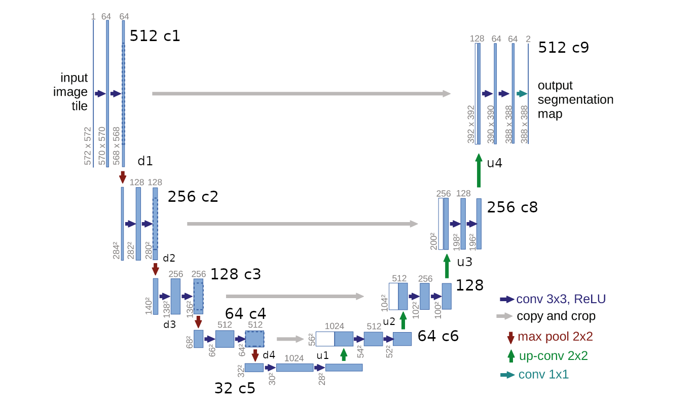

# U-NET
U-NET was a break through in image segmentation, specially for bio medical usecases, where the data is less but complex for the model to learn.

It's a image to image neural net, more likely called Auto Encoder. 

The U-Net is called U because it looks like a U :O

What they mentioned in the paper
1. They used fully convolutional network, with no fully connected or dense layers. 
2. It works with very less data. And data is highly augmented.
3. Conv Transpose is used instead of Up Sampling. 
4. In upsampling the image, large number of features are provided to ensure the proper transfer of information. 
5. Originally in the paper, they used unpadded convolutional, resulting in smaller image than the actual image. 
6. Cross Entropy Loss was used. 

And yeah, I couldn't train this big boi model :P
Because yeah, it need's gpu :O